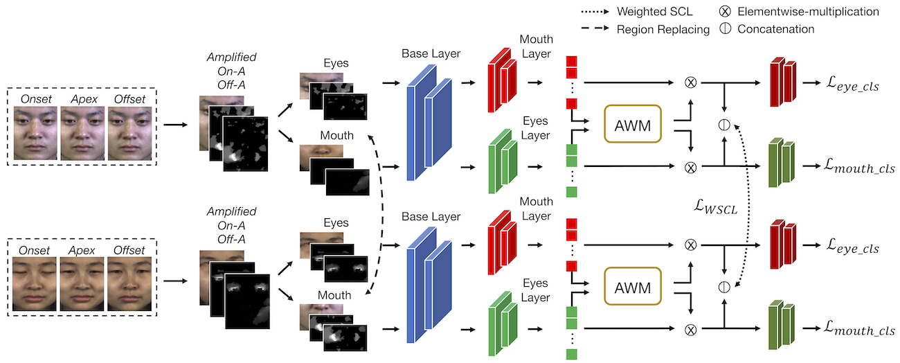
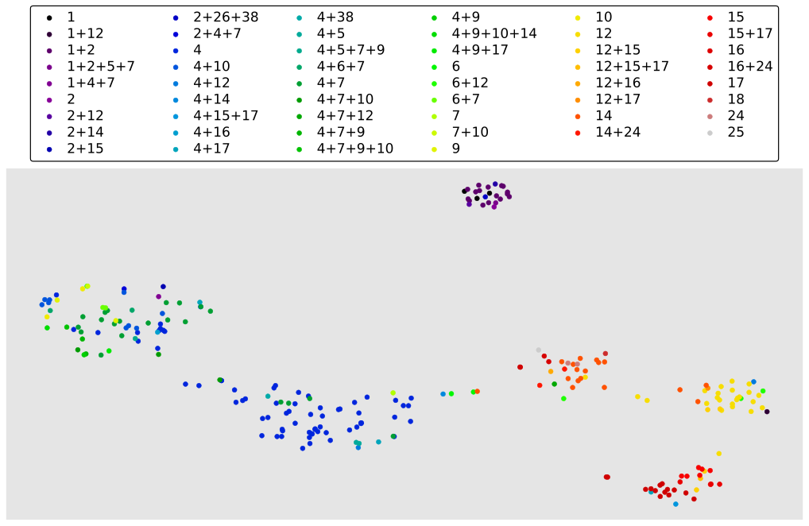

# README



## Introduction
This repo is the source code for the paper: **"Mimicking the Annotation Process for Recognizing the Micro Expressions"**.

## Installation
* Set up the environment
  ```shell
  # Requires Python >= 3.8
  $ pip install -r requirements.txt
  ```
* Download landmarks file from dlib
  ```shell
  $ wget https://github.com/davisking/dlib-models/raw/master/shape_predictor_68_face_landmarks.dat.bz2 -P weight
  $ bzip2 -d weight/shape_predictor_68_face_landmarks.dat.bz2 
  ```
* Download the pretrained weights
  ```shell
  $ bash download.sh
  ```
  
## Preprocessing

### Face cropping
```shell
# Crop the CASME II dataset
#   We use OpenFace to crop the CASME II dataset
#   Refer to: https://github.com/TadasBaltrusaitis/OpenFace 

# Crop the SAMM dataset
$ python utils/samm_crop.py \
  --ori_path <original SAMM root> \
  --new_path <new path to save the crop image>
```

### Magnified the image frame
We use [Learning-based Motion Magnification](https://github.com/12dmodel/deep_motion_mag) to amplify our image frame. Follow the setup and install the requirements (recommend opening a new environment and not mix up with the previous one). **Put the files in `magnifed` to `deep_motion_mag` folder**.
```shell
# Set up deep_motion_mag
$ <clone the deep_motion_mag and setup the environment>

# Create magnified frame for CASME II and SAMM
$ python get_casme_img.py \
  --img_root  \
  --csv_file ../csv_file/CASME.csv
  
$ python get_samm_img.py \
  --img_root  \
  --csv_file ../csv_file/SAMM.csv
```

### Create the *On-A* and *Off-A* frames
```shell
$ python utils/crop_face_optical.py \
  --file_name csv_file/CASME.csv \
  --img_root  \
  --catego casme
  
$ python utils/crop_face_optical.py \
  --file_name csv_file/SAMM.csv \
  --img_root  \
  --catego samm  
```
 
## Training
The training file is put in the `train_bash` folder. Users should change the image root in the bash file first.
```shell
# Training five-class and three-class CASME II and SAMM
$ bash train_bash/five_casme.sh
$ bash train_bash/five_samm.sh
$ bash train_bash/three_casme.sh
$ bash train_bash/three_samm.sh
```

## Testing
To test our training weights, users should download the files in the [Installation Section](#Installation).
```shell
# Test for the five-class CASME II
$ python test.py \
  --img_root  \
  --csv_file csv_file/sep_five_casme.csv \
  --weight_root weight/five_casme_best \
  --catego casme \
  --num_classes 5
  
# Test for the five-class SAMM
$ python test.py \
  --img_root  \
  --csv_file csv_file/sep_five_samm.csv \
  --weight_root weight/five_samm_best \
  --catego samm \
  --num_classes 5

# Test for the three-class CASME II
$ python test.py \
  --img_root  \
  --csv_file csv_file/sep_three_casme.csv \
  --weight_root weight/three_casme_best \
  --catego casme \
  --num_classes 3

# Test for the three-class SAMM
$ python test.py \
  --img_root  \
  --csv_file csv_file/sep_three_samm.csv \
  --weight_root weight/three_samm_best \
  --catego samm \
  --num_classes 3
```

Our results are shown in the below table:
<table>
  <tr>
    <th></th>
    <th colspan="2">CASME II</th>
    <th colspan="2">SAMM</th>
  </tr>
  <tr>
    <td><b>Class Type</b></td>
    <td>Acc</td>
    <td>F1</td>
    <td>Acc</td>
    <td>F1</td>
  </tr>
  <tr>
    <td><b>Five Categories</b></td>
    <td>0.8333</td>
    <td>0.8267</td> 
    <td>0.7941</td>
    <td>0.7582</td>
  </tr>
  <tr> 
    <td><b>Three Categories</b></td>
    <td>0.932</td>
    <td>0.925</td> 
    <td>0.865</td>
    <td>0.816</td>
  </tr>

</table>

## Visualization
* Distribution plot
  ```shell
  # For CASME II distribution plot
  $ python utils/plot_dist.py \
    --img_root  \
    --csv_file csv_file/sep_five_casme.csv \
    --catego casme \
    --weight_path weight/five_casme_best/model_best_1.pt \
    --save_fig <place to generate the plot>
  
  # For SAMM distribution plot
  $ python utils/plot_dist.py \
    --img_root  \
    --csv_file csv_file/sep_five_samm.csv \
    --catego samm \
    --weight_path weight/five_samm_best/model_best_6.pt \
    --save_fig <place to generate the plot>
  ```
* AU-CAM
  ```shell
  # For CASME II AU-CAM
  $ python utils/au_cam.py \
    --img_root  \
    --csv_file csv_file/sep_five_casme.csv \
    --catego casme \
    --weight_path weight/five_casme_best/model_best_1.pt \
    --num_classes 5
    --save_path <place to save the AU-CAM>
  
  # For SAMM AU-CAM
  $ python utils/au_cam.py \
    --img_root  \
    --csv_file csv_file/sep_five_samm.csv \
    --catego samm \
    --weight_path weight/five_samm_best/model_best_6.pt \
    --num_classes 5
    --save_path <place to save the AU-CAM>
  ```

## Distribution Plot
### CASME II


### SAMM


## Citation
```bib
@inproceedings{ruan2022mimicking,
  title={Mimicking the Annotation Process for Recognizing the Micro Expressions},
  author={Ruan, Bo-Kai and Lo, Ling and Shuai, Hong-Han and Cheng, Wen-Huang},
  booktitle={ACM International Conference on Multimedia},
  year={2022}
}
```
